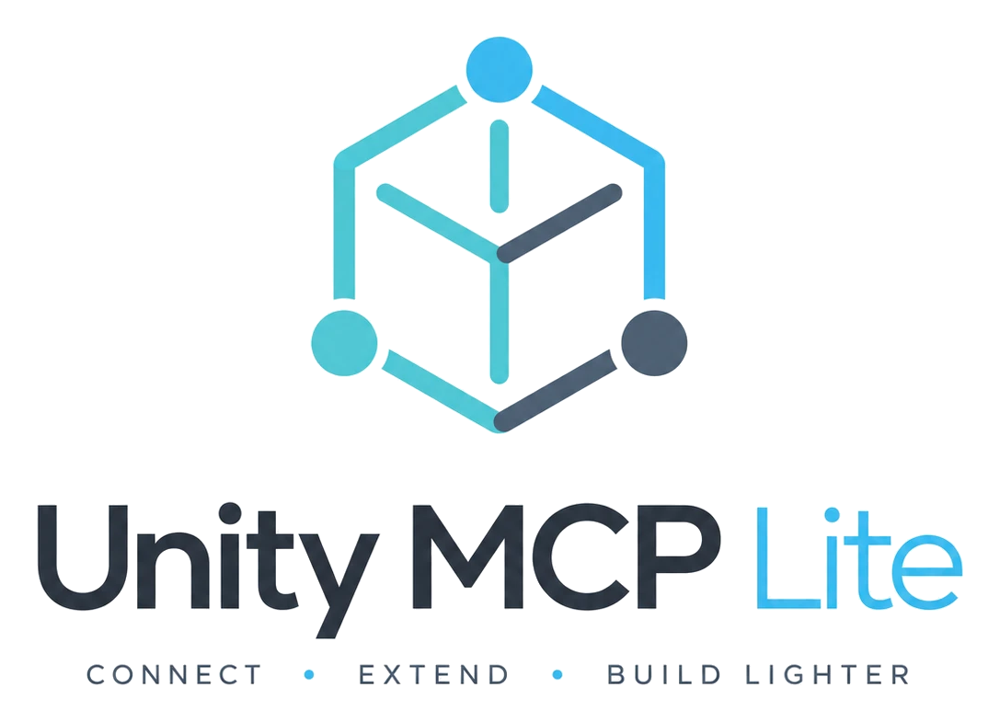

<p align="center">
  <picture>
    <source media="(prefers-color-scheme: dark)" srcset="docs/images/unity-mcp-light-logo-dark.png">
    
  </picture>
</p>

<p align="center">
  A slimmed-down fork of <a href="https://github.com/CoplayDev/unity-mcp">MCP for Unity</a> that spends less of your AI's context window on tool definitions.
</p>

---

## Why this fork

Every MCP tool a server exposes has a name, a description and a parameter schema, and many clients send all of them to the model before you type a word. The upstream MCP for Unity ships 48 tools, about **29k tokens** of definitions. That context is paid on every conversation, whether or not you ever touch ProBuilder or the Profiler.

This fork removes tools that most Unity workflows don't need and trims the definitions of the ones that remain:

| | Upstream | Light |
|---|---|---|
| Tools | 48 | **36** |
| Tool definitions (approx. tokens) | ~28.9k | **~18.8k** |

Everything else — scenes, GameObjects, components, scripts, assets, prefabs, materials, shaders, procedural textures, camera, graphics, physics, builds, tests, UI Toolkit, API reflection — works the same as upstream.

## What was removed

| Tool | What it did |
|---|---|
| `generate_image`, `generate_model`, `generate_audio` | AI asset generation through third-party providers |
| `import_model` | Sketchfab marketplace search and import |
| `manage_probuilder` | ProBuilder mesh modeling |
| `manage_profiler` | Profiler sessions, counters, memory snapshots, Frame Debugger |
| `manage_vfx` | VFX Graph, particles, line and trail renderers |
| `manage_animation` | Animator control and AnimationClip creation |
| `manage_packages` | Package Manager install/remove/search |
| `unity_docs` | Fetching docs from docs.unity3d.com |
| `debug_request_context` | Server debugging helper |
| `manage_script_capabilities` | Listed the supported script-edit operations |

`import_model_file` (local `.fbx`/`.obj`/`.glb`/`.gltf`/`.zip`) is **kept**.

Each removed tool is gone from the Python server, the Unity handlers, the CLI, the tests and the bundled `unity-mcp-skill` docs, so nothing still describes a tool that no longer exists.

Other changes:
- **Smaller schemas.** Optional parameters no longer carry Pydantic's null padding. `Optional[str] = None` used to be advertised as `{"anyOf": [{"type": "string"}, {"type": "null"}], "default": null}` and is now just `{"type": "string"}`. That alone saves about 3.5k tokens. Explicit `null` arguments are still accepted.
- `read_console` returns **errors only** by default (it used to return errors, warnings and logs). Projects with many warnings no longer flood the context; pass `types=["error", "warning"]` when you want warnings.
- `get_test_job` now recommends a `wait_timeout` of 15–30 seconds instead of 30–60.

## Install

**Requirements:** Unity 2021.3 LTS – 6.x, Python 3.10+ and [`uv`](https://docs.astral.sh/uv/). Works with any MCP client (Claude Code, Claude Desktop, Cursor, VS Code, Windsurf, Cline, Gemini CLI and others).

1. **Add the Unity package.** In Unity, open **Window → Package Manager → + → Add package from git URL** and enter:

   ```
   https://github.com/Talhasarac/unity-mcp-light.git?path=/MCPForUnity#main
   ```

   The package keeps the upstream package id (`com.coplaydev.unity-mcp`), so remove the upstream package first if you have it installed.

2. **Configure your client.** Open **Window → Unity MCP Light**, and on the **Connect** tab choose **Configure All Detected Clients** (or configure one client), then restart your MCP client.

   Clients are registered under the server name **`unity-mcp-light`** (for example `claude mcp add ... unity-mcp-light` in Claude Code, `[mcp_servers.unity-mcp-light]` in Codex). The Python server is fetched from this repository's `Server/` folder on `main`, not from PyPI, so you get this fork's trimmed tool set without extra setup.

3. **Install the skill (optional).** **Install Skills** on the Connect tab copies the agent skill to `~/.claude/skills/unity-mcp-light` (Claude Code) or `~/.codex/skills/unity-mcp-light` (Codex).

4. **Try it.** Ask: *"Create a cube at the origin and add a Rigidbody."*

To run the server from a local clone instead, set **Advanced → Server Source** to your clone's `Server` folder.

## Keeping context small

- **Tool groups.** Tools are grouped (`core`, `vfx`, `ui`, `testing`, `docs`, `scripting_ext`, `asset_gen`). Only `core` is on by default over HTTP; turn the others on when you need them with `manage_tools`, or on the **Tools** tab in Unity. The `vfx` group now holds only `manage_shader` and `manage_texture`.
- **Clients with tool search** (such as Claude Code) load tool definitions only when needed, so the savings here matter most for clients that load every definition up front.
- **The skill.** `unity-mcp-skill/` gives agents usage guidance. It is large; install it only if your agent benefits from it.

## Development

The server lives in `Server/`, and the Unity package lives in `MCPForUnity/`.

```bash
cd Server
uv run --extra dev pytest -q
```

To measure how many tokens the tool definitions cost, list the tools through FastMCP and count the characters of each serialized definition (roughly 4 characters per token).

## Credits

This is a fork of [MCP for Unity](https://github.com/CoplayDev/unity-mcp) by [Coplay](https://github.com/CoplayDev) and its contributors. All the real work is theirs; this fork only trims it. For the full feature set, documentation and community, use the upstream project.

If MCP for Unity helped your research, please cite the original work:

```bibtex
@inproceedings{wu2025mcpunity,
  author    = {Wu, Shutong and Barnett, Justin P.},
  title     = {{MCP-Unity}: {Protocol-Driven} Framework for Interactive {3D} Authoring},
  year      = {2025},
  isbn      = {9798400721366},
  publisher = {Association for Computing Machinery},
  address   = {New York, NY, USA},
  url       = {https://doi.org/10.1145/3757376.3771417},
  doi       = {10.1145/3757376.3771417},
  series    = {SA Technical Communications '25}
}
```

Not affiliated with Unity Technologies.

**License:** MIT — see [LICENSE](LICENSE).
